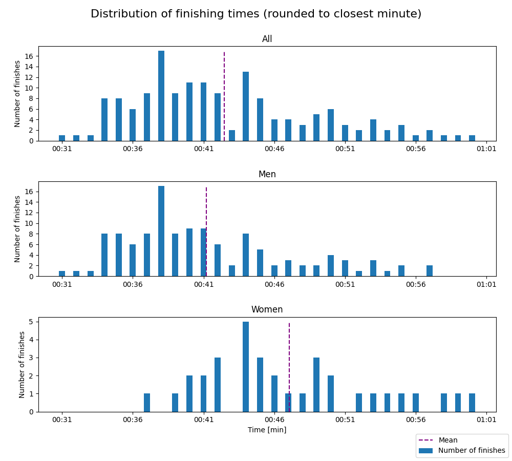
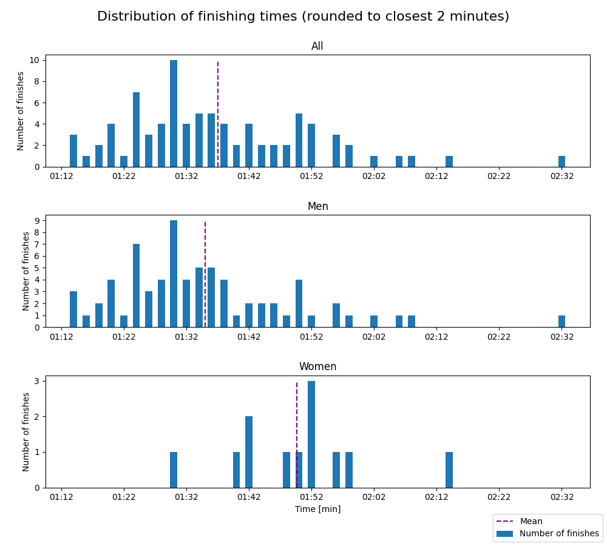
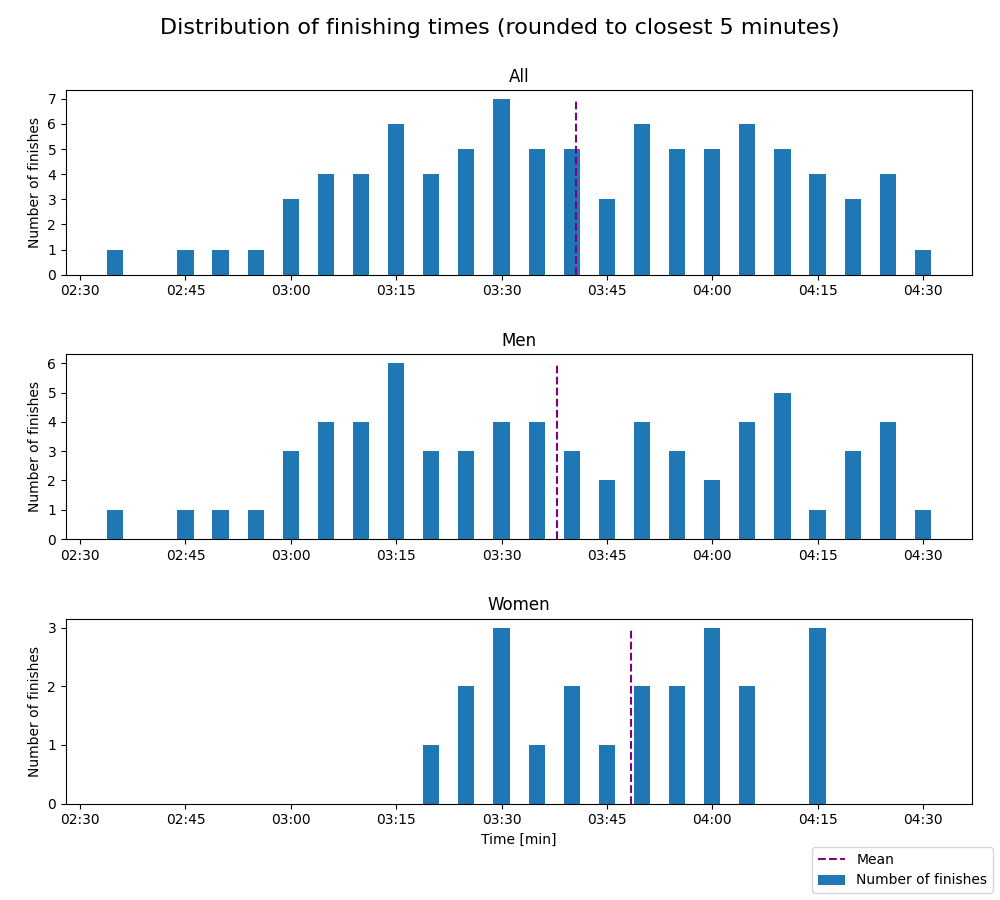
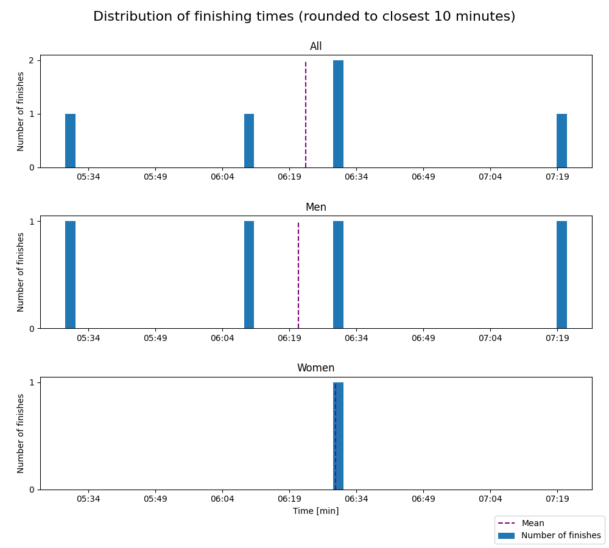

# Bislett Indoor Marathon - 2024

Distances: 10 km, half marathon, marathon and triple

## 10 km

- Type: Indoor track race. 546.5 m track with two lanes.
- The three races (friday, saturday and elite) are merged into one in the distribution graph.

#### Statistics

Finishes better than 0:25 and worse than 1:30 are filtered out. Results faster than 0:25 are due to
faulty data (e.g. DNFs) and results worse than 1:30 makes the distribution plots hard to read, as the entire
distribution gets shifted left.

Finishes without a registered category are also filtered out.

| Class            | Fastest runner | Mean time | Median time | Finishers |
|------------------|----------------|-----------|-------------|-----------|
| All days         | 00:31          | 00:42     | 00:41       | 156       |
| All days - Women | 00:36          | 00:47     | 00:45       | 34        |
| All days - Men   | 00:31          | 00:41     | 00:39       | 122       |
| Friday           | 00:33          | 00:43     | 00:42       | 59        |
| Friday - Women   | 00:38          | 00:46     | 00:44       | 20        |
| Friday - Men     | 00:33          | 00:41     | 00:40       | 39        |
| Saturday         | 00:37          | 00:45     | 00:44       | 62        |
| Saturday - Women | 00:41          | 00:48     | 00:48       | 13        |
| Saturday - Men   | 00:37          | 00:44     | 00:42       | 49        |
| Elite            | 00:31          | 00:36     | 00:36       | 35        |
| Elite - Women    | 00:36          | 00:36     | 00:36       | 1         |
| Elite - Men      | 00:31          | 00:36     | 00:36       | 34        |

#### Distribution

## Half marathon

- Type: Indoor track race. 546.5 m track with two lanes.

#### Statistics

Finishes better than 0:50 and worse than 4:00 are filtered out. Results faster than 0:50 are due to
faulty data (e.g. DNFs) and results worse than 4:00 makes the distribution plots hard to read, as the entire
distribution gets shifted left.

| Class | Fastest runner | Mean time | Median time | Finishers |
|-------|----------------|-----------|-------------|-----------|
| All   | 01:14          | 01:37     | 01:33       | 84        |
| Women | 01:29          | 01:49     | 01:50       | 12        |
| Men   | 01:14          | 01:34     | 01:32       | 72        |

#### Distribution

## Marathon

- Type: Indoor track race. 546.5 m track with two lanes.

#### Statistics

Finishes better than 1:40 and worse than 8:00 are filtered out. Results faster than 1:40 are due to
faulty data (e.g. DNFs) and results worse than 6:00 makes the distribution plots hard to read, as the entire
distribution gets shifted left.

| Class | Fastest runner | Mean time | Median time | Finishers |
|-------|----------------|-----------|-------------|-----------|
| All   | 02:36          | 03:40     | 03:38       | 89        |
| Women | 03:18          | 03:48     | 03:51       | 22        |
| Men   | 02:36          | 03:37     | 03:36       | 67        |

#### Distribution

## Triple

- Type: Indoor track race. 546.5 m track with two lanes.

#### Statistics

No results are filtered out.

| Class | Fastest runner | Mean time | Median time | Finishers |
|-------|----------------|-----------|-------------|-----------|
| All   | 05:28          | 06:22     | 06:29       | 5         |
| Women | 06:29          | 06:29     | 06:29       | 1         |
| Men   | 05:28          | 06:20     | 06:19       | 4         |

#### Distribution

