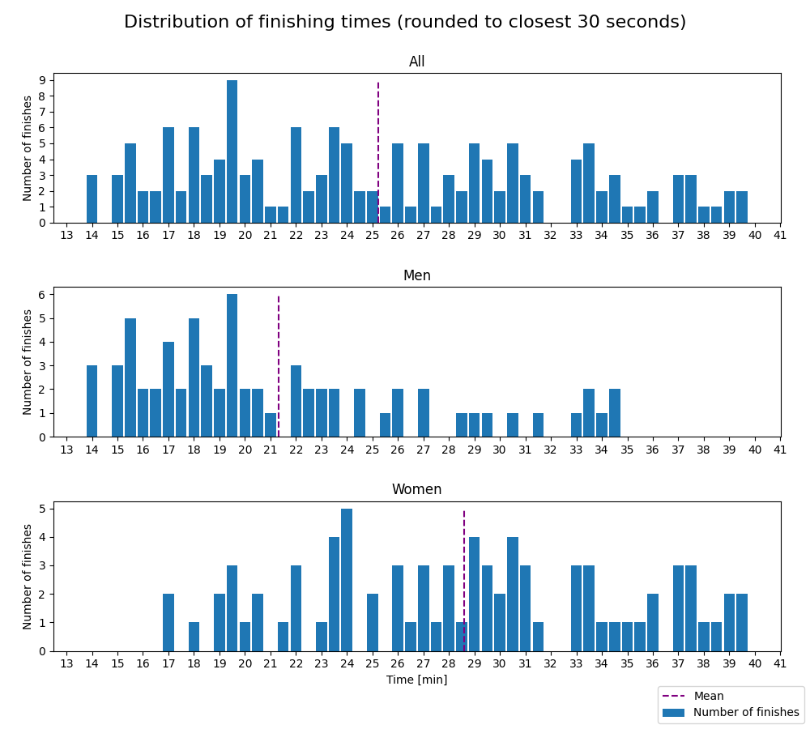
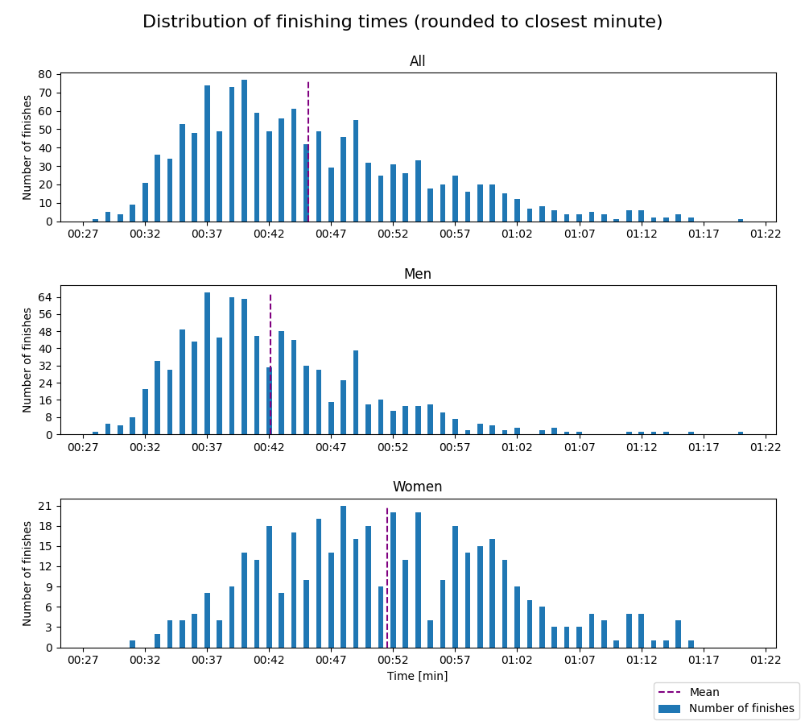

# Drammen10K - 2023

Distances: 5 km and 10 km

### 5 km

- Type: Road race, only on asphalt

#### Statistics

Finishes better than 0:12:00 and worse than 0:40:00 are filtered out. Results faster than 0:12:00 are due to
faulty data (e.g. DNFs) and results worse than 0:40:00 makes the distribution plots hard to read, as the entire
distribution gets shifted left.

| Class | Fastest runner | Mean time | Median time | Finishers |
|-------|----------------|-----------|-------------|-----------|
| All   | 13:51          | 25:12     | 24:13       | 149       |
| Women | 17:09          | 28:34     | 28:46       | 80        |
| Men   | 13:51          | 21:18     | 19:35       | 69        |

#### Distribution

### 10 km

- Type: Road race, only on asphalt
- Elevation gain: 22 m

#### Statistics

Finishes better than 0:25 and worse than 1:30 are filtered out. Results faster than 0:25 are due to
faulty data (e.g. DNFs) and results worse than 1:30 makes the distribution plots hard to read, as the entire
distribution gets shifted left.

| Class               | Fastest runner | Mean time | Median time | Finishers |
|---------------------|----------------|-----------|-------------|-----------|
| All classes         | 00:28          | 00:45     | 00:43       | 1285      |
| All classes - Women | 00:31          | 00:51     | 00:51       | 415       |
| All classes - Men   | 00:28          | 00:42     | 00:40       | 870       |

#### Distribution

