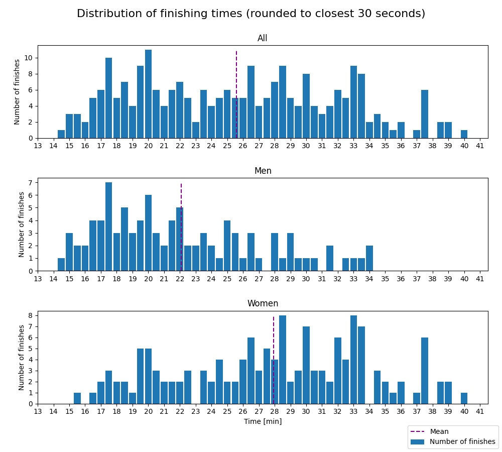
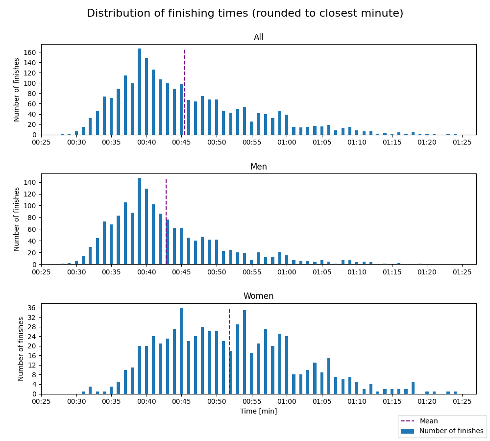

# Drammen10K - 2024

Distances: 5 km and 10 km

### 5 km

- Type: Road race, only on asphalt

#### Statistics

Finishes better than 0:12:00 and worse than 0:40:00 are filtered out. Results faster than 0:12:00 are due to
faulty data (e.g. DNFs) and results worse than 0:40:00 makes the distribution plots hard to read, as the entire
distribution gets shifted left.

| Class | Fastest runner | Mean time | Median time | Finishers |
|-------|----------------|-----------|-------------|-----------|
| All   | 14:21          | 25:34     | 25:33       | 239       |
| Women | 15:33          | 27:56     | 28:22       | 142       |
| Men   | 14:21          | 22:05     | 20:58       | 97        |

#### Distribution

### 10 km

- Type: Road race, only on asphalt
- Elevation gain: 22 m

#### Statistics

Finishes better than 0:25 and worse than 1:30 are filtered out. Results faster than 0:25 are due to
faulty data (e.g. DNFs) and results worse than 1:30 makes the distribution plots hard to read, as the entire
distribution gets shifted left.

| Class | Fastest runner | Mean time | Median time | Finishers |
|-------|----------------|-----------|-------------|-----------|
| All   | 00:27          | 00:45     | 00:43       | 2313      |
| Women | 00:31          | 00:51     | 00:50       | 682       |
| Men   | 00:27          | 00:42     | 00:40       | 1631      |

#### Distribution

