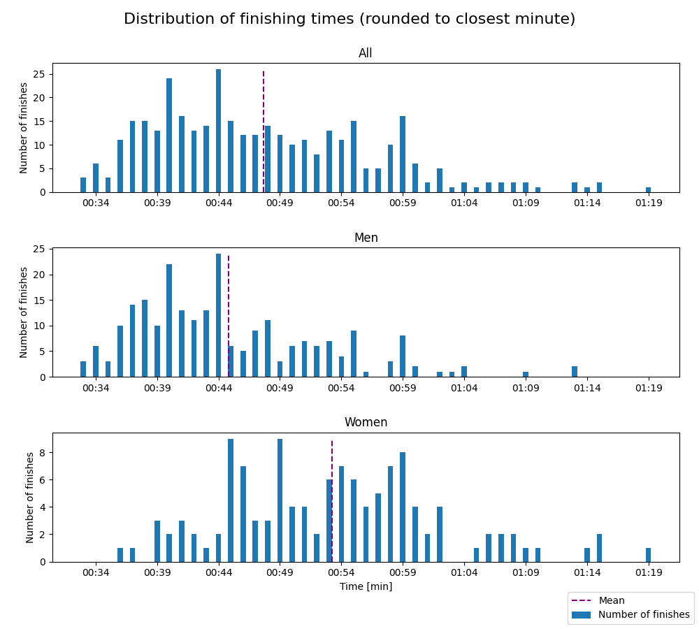
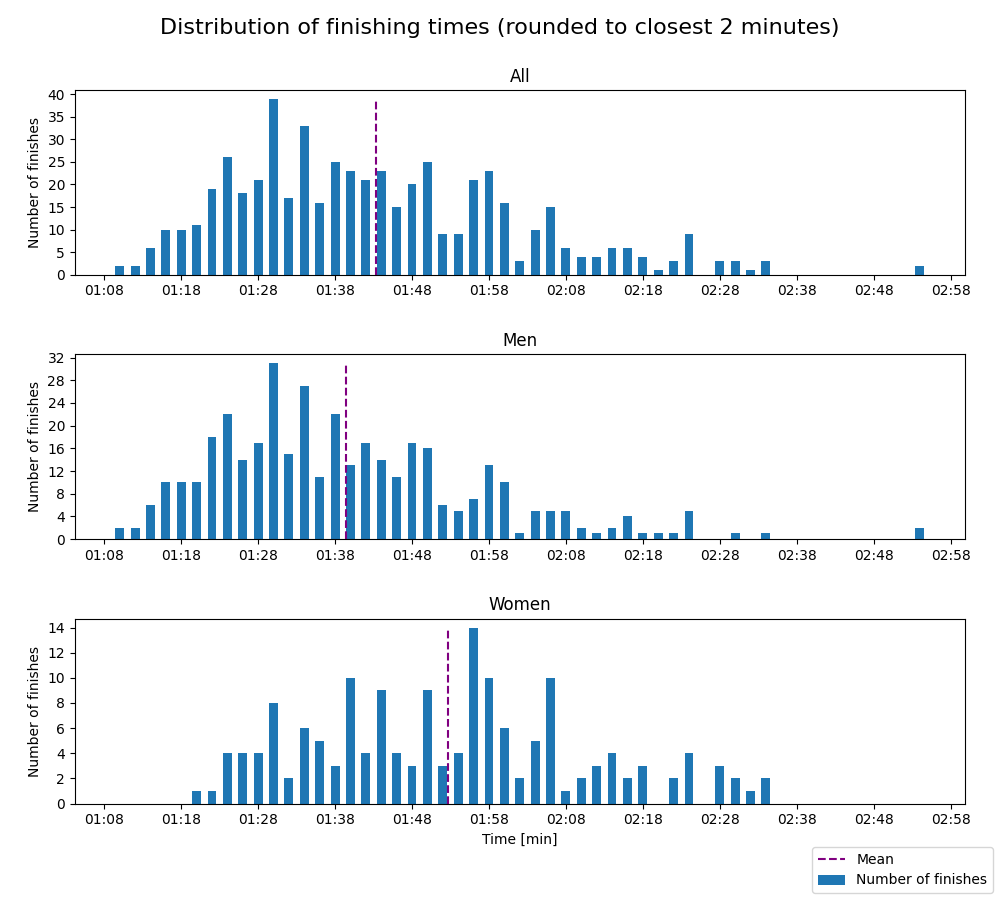
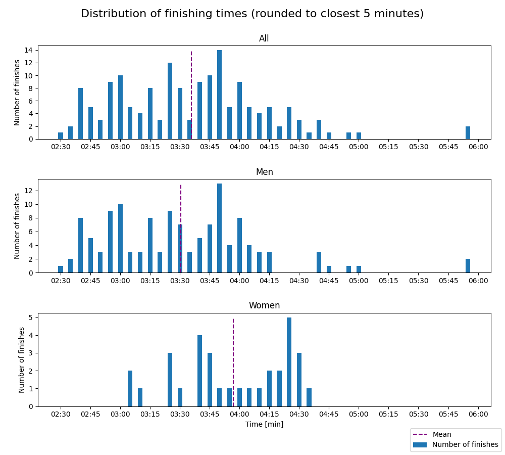

# Jessheim vintermaraton - 2023

Distances: 10 km, half marathon and marathon

## 10 km

- Type: Road race

#### Statistics

Finishes better than 0:25 and worse than 1:30 are filtered out. Results faster than 0:25 are due to
faulty data (e.g. DNFs) and results worse than 1:30 makes the distribution plots hard to read, as the entire
distribution gets shifted left.

| Class | Fastest runner | Mean time | Median time | Finishers |
|-------|----------------|-----------|-------------|-----------|
| All   | 00:32:56       | 00:47:40  | 00:45:57    | 360       |
| Women | 00:36:24       | 00:53:14  | 00:53:03    | 122       |
| Men   | 00:32:56       | 00:44:49  | 00:43:27    | 238       |

#### Distribution

## Half marathon

- Type: Road race

#### Statistics

Finishes better than 0:50 and worse than 4:00 are filtered out. Results faster than 0:50 are due to
faulty data (e.g. DNFs) and results worse than 4:00 makes the distribution plots hard to read, as the entire
distribution gets shifted left.

| Class | Fastest runner | Mean time | Median time | Finishers |
|-------|----------------|-----------|-------------|-----------|
| All   | 01:09:48       | 01:43:18  | 01:39:58    | 543       |
| Women | 01:20:39       | 01:52:41  | 01:53:01    | 160       |
| Men   | 01:09:48       | 01:39:22  | 01:36:32    | 383       |

#### Distribution

## Marathon

- Type: Road race

#### Statistics

Finishes better than 1:40 and worse than 8:00 are filtered out. Results faster than 1:40 are due to
faulty data (e.g. DNFs) and results worse than 6:00 makes the distribution plots hard to read, as the entire
distribution gets shifted left.

| Class | Fastest runner | Mean time | Median time | Finishers |
|-------|----------------|-----------|-------------|-----------|
| All   | 02:31:39       | 03:35:46  | 03:36:34    | 161       |
| Women | 03:03:19       | 03:56:54  | 03:58:10    | 32        |
| Men   | 02:31:39       | 03:30:32  | 03:27:52    | 129       |

#### Distribution

