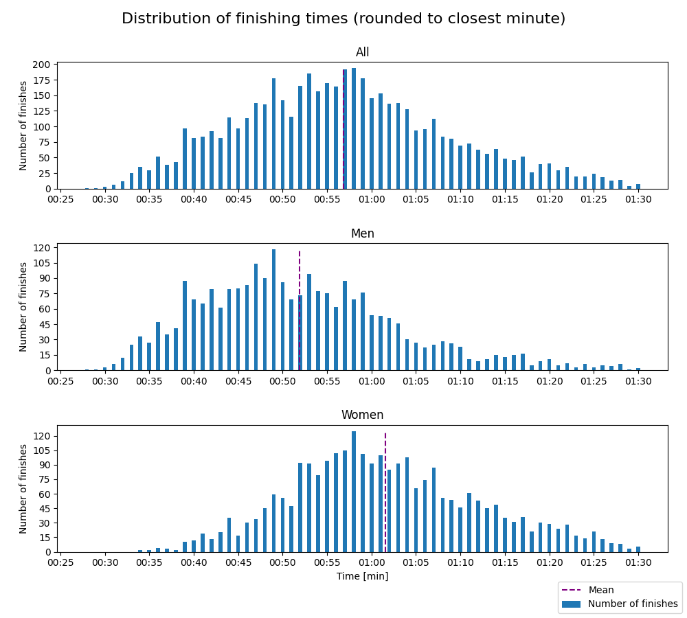
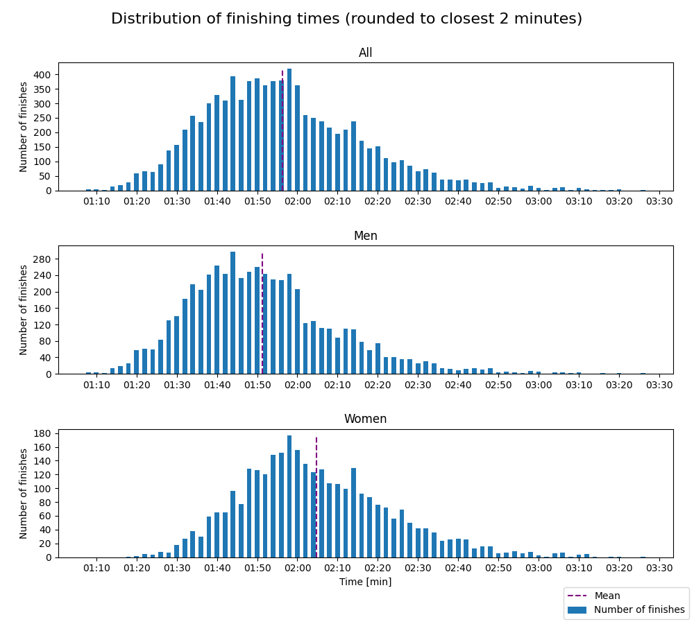
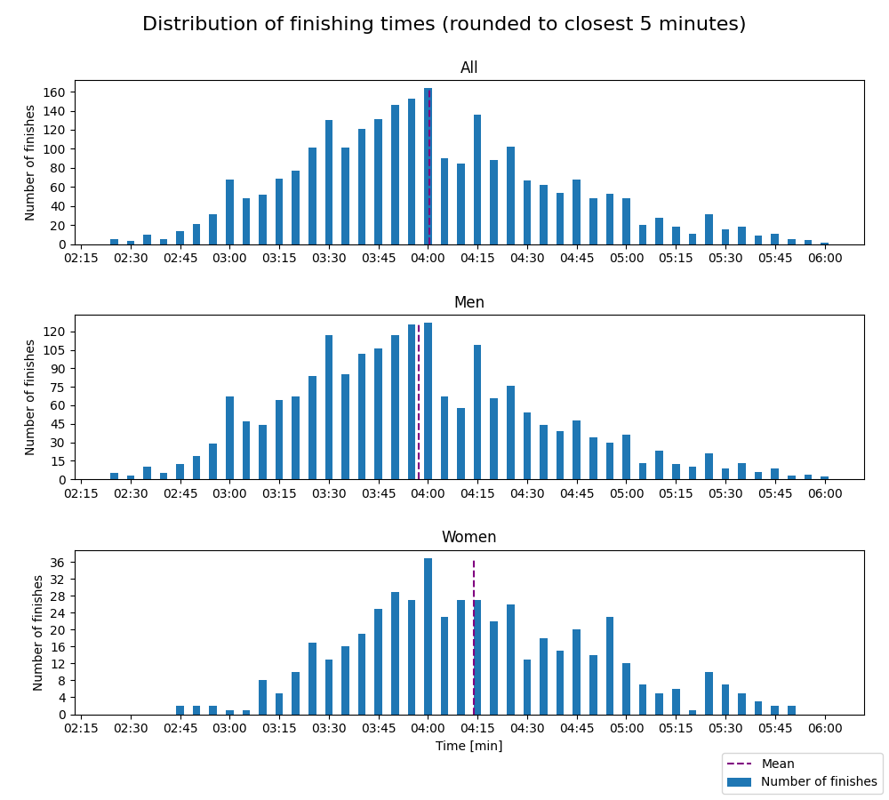
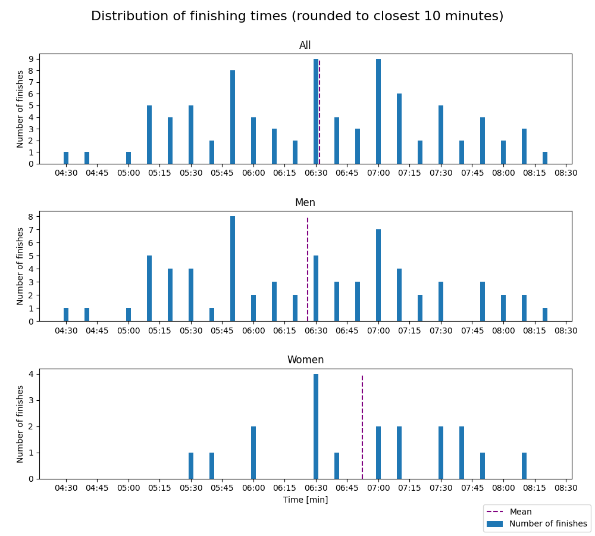

# Oslo Maraton - 2023

Distances: 10 km, half marathon, marathon and triple

## 10 km

- Type: Road race

#### Statistics

Finishes better than 0:25 and worse than 1:30 are filtered out. Results faster than 0:25 are due to
faulty data (e.g. DNFs) and results worse than 1:30 makes the distribution plots hard to read, as the entire
distribution gets shifted left.

| Class | Fastest runner | Mean time | Median time | Finishers |
|-------|----------------|-----------|-------------|-----------|
| All   | 00:28          | 00:56     | 00:56       | 5035      |
| Women | 00:33          | 01:01     | 01:00       | 2579      |
| Men   | 00:28          | 00:51     | 00:50       | 2456      |

#### Distribution

## Half marathon

- Type: Road race

#### Statistics

Finishes better than 0:50 and worse than 4:00 are filtered out. Results faster than 0:50 are due to
faulty data (e.g. DNFs) and results worse than 4:00 makes the distribution plots hard to read, as the entire
distribution gets shifted left.

| Class | Fastest runner | Mean time | Median time | Finishers |
|-------|----------------|-----------|-------------|-----------|
| All   | 01:07          | 01:56     | 01:54       | 8659      |
| Women | 01:17          | 02:04     | 02:02       | 3170      |
| Men   | 01:07          | 01:51     | 01:49       | 5489      |

#### Distribution

## Marathon

- Type: Road race

#### Statistics

Finishes better than 1:40 and worse than 8:00 are filtered out. Results faster than 1:40 are due to
faulty data (e.g. DNFs) and results worse than 6:00 makes the distribution plots hard to read, as the entire
distribution gets shifted left.

| Class | Fastest runner | Mean time | Median time | Finishers |
|-------|----------------|-----------|-------------|-----------|
| All   | 02:25          | 04:00     | 03:56       | 2524      |
| Women | 02:44          | 04:13     | 04:10       | 502       |
| Men   | 02:25          | 03:57     | 03:53       | 2022      |

#### Distribution

## Triple

- Type: Road race

#### Statistics

No results are filtered out.

| Class | Fastest runner | Mean time | Median time | Finishers |
|-------|----------------|-----------|-------------|-----------|
| All   | 04:27          | 06:31     | 06:33       | 86        |
| Women | 05:28          | 06:52     | 07:00       | 19        |
| Men   | 04:27          | 06:25     | 06:30       | 67        |

#### Distribution

