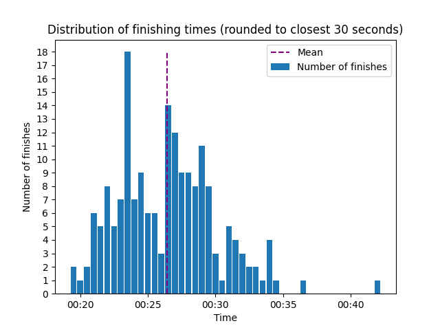
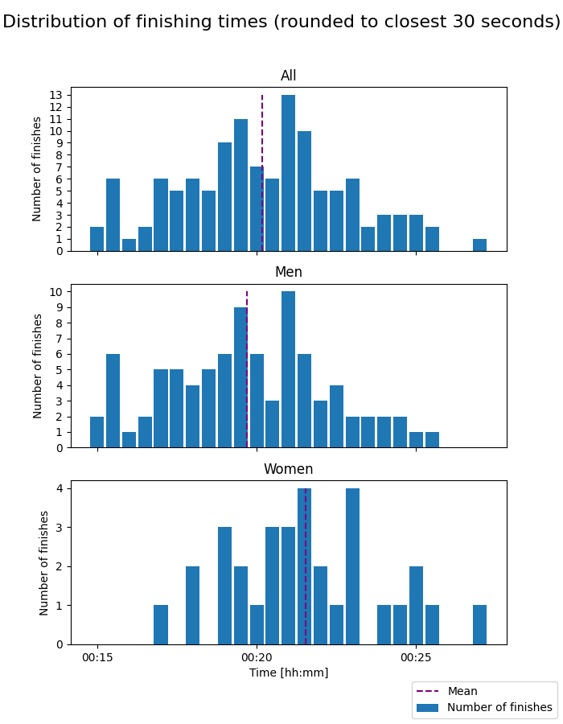

# Nydalsløpet

## 2023

- Distance: 5 km
- Type: Road race, partially on gravel
- Elevation gain: 55 m

### Mosjon

Finishers taken into account: 184 (108 men and 76 women)

### Aktiv

Finishers taken into account: 119 (87 men and 32 women)

### Statistics

| Class          | Fastest runner | Mean time | Median time |
|----------------|----------------|-----------|-------------|
| Mosjon - All   | 19:39.64       | 26:25.85  | 26:30.94    |
| Mosjon - Women | 20:47:03       | 27:35.67  | 27:14.20    |
| Mosjon - Men   | 19:39.64       | 25:36.72  | 25:12.31    |
| Aktiv  - All   | 15:08.40       | 20:11.20  | 20:12.62    |
| Aktiv  - Women | 17:01.45       | 21:31.82  | 21:16.54    |
| Aktiv  - Men   | 15:08.40       | 19:41.55  | 19:36.33    |
